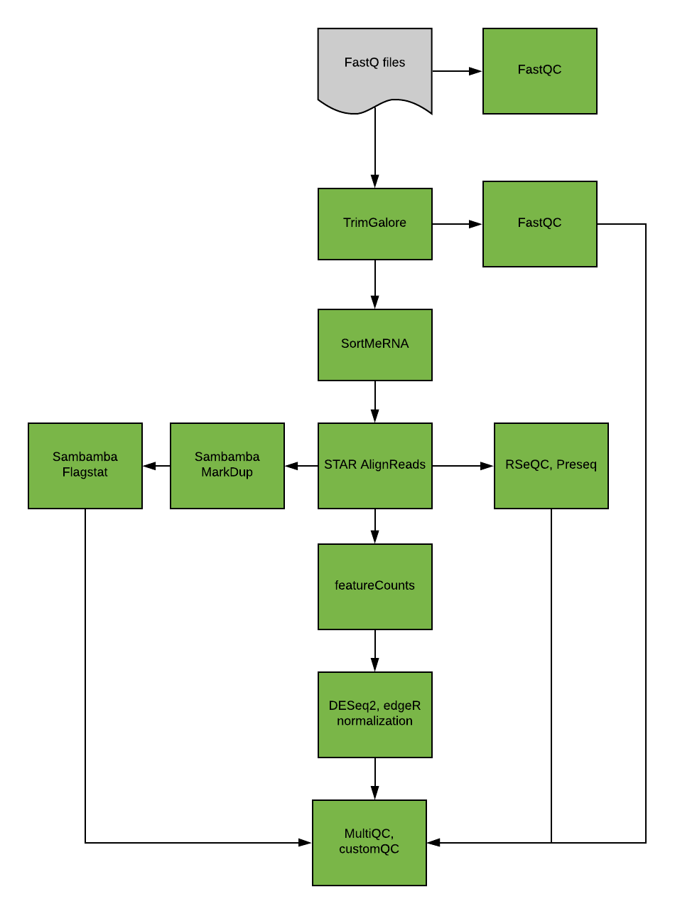

\newpage

# RNA-SEQ PIPELINE

RNASeq-NF is an NGS analysis pipeline for RNA expression quantification and germline variant calling (GATK4).

[https://github.com/UMCUGenetics/RNASeq-NF/](https://github.com/UMCUGenetics/RNASeq-NF/)

**The pipeline performs the following tasks.**  

- Read QC (FastQC)  
- Sequence trimming (TrimGalore)  
- rRNA removal (SortMeRNA)  
- Mapping and read-group annotation (STAR)  
- Alignment-QC (RSeQC, Preseq)  
- PCR duplicate detection (Sambamba MarkDup)  
- Gene-expression/biotype quantification ( featureCounts)  
- Gene-expression normalization ( edgeR, DESeq2)  
- Transcript quantification (Salmon)  
- Variant calling (GATK4)  
- QC report (MultiQC, CustomQC)  

## Core analysis workflow

Please refer to the nf-core rnaseq [manual](https://nf-co.re/rnaseq/docs/output) for a description on how to interpret the different output files.  

This implementation is a work in progress and aims to reach feature parity with the [UMCU RNASeq pipeline](https://github.com/UMCUGenetics/RNASeq) while also introducing new features and methods according to developments in the field.  

Several components have been adapted from the [nf-core rnaseq](https://github.com/nf-core/rnaseq) community pipeline and rewritten in [DSL2](https://www.nextflow.io/docs/edge/dsl2.html) syntax to enable a more modular setup.  

## Download and information

The pipeline can be downloaded from the link below:

[https://github.com/UMCUGenetics/RNASeq-NF/](https://github.com/UMCUGenetics/RNASeq-NF/)

Follow the "Getting Started" section to set up the pipeline for own use. 

\newpage

## Output description

Descriptions of the contents of the resulting processed data folder.
	
- **.nextflow/**  
Nextflow cache and logging files, not of importance for the user but kept for completeness

- **conf/**  
A copy various general configuration files used for the pipeline, containing parameters, resources, etc

- **featureCounts/**  
The various readcounts, this includes raw readcounts, normalized readcounts, a summary and assignment to biotypes
    * **featureCounts/biotypes/**   
		An overview of count assignment to biotypes

- **log/**  
Pipeline logs and nextflow report files (regarding resource usage, time taken, etc)

- **QC/**  
Various QC logs and reports	
	* **QC/FastQC/**  
		FastQC reports on the raw fastq files
		
	* **QC/Preseq/**  
		Output for PreSeq alignment QC package
		
	* **QC/RSeQC/**  
		RSeQC provides a number of modules to evaluate sequence data, such as strandedness, read duplication, distribution, inner distance. This folder contains the log files as well as the removed rRNA reads in fastq.gz format for all samples
		
	* **QC/SortMeRNA/**  
		SortMeRNA is used to remove rRNA reads, this folder contains the removed reads as well as the reports resulting from this process	
		
	* **QC/TrimGalore/**  
		TrimGalore is used to trim reads based on quality and adapter presence as well as quality control, this folder contains the logs from this process as well as the FastQC reports from the trimmed fastq data	
	

- **report/**  
    Summary reports giving a broad summary of the various QC and other logs
	* **report/MultiQC/**  
		MultiQC collects all information from the various QC modules as well as other tools (STAR, sambamba) and shows this in a summary overview in order to get a good and quick overview of the statistics of the various steps in the pipeline for this run
		
	* **report/Custom_QC/**  
		A custom QC report for the inhouse pipeline

- **Sambamba/**  
	Sambamba flagstats report which contains statistics drawn from the generated .bam read flags

- **STAR/**  
	RNA-seq reads are aligned to the reference genome using STAR, which was designed to specifically address many of the challenges of RNA-seq data mapping, and uses a novel strategy for spliced alignments.
	* **STAR/logs/**  
		Logs and reports from STAR regarding the alignment process
		
	* **STAR/mapped/**  
		The resulting aligned data in .bam formwat with corresponding .bam.bai index files. These can be viewed in for example the IGV genome browser or used for further analysis
		
	* **STAR/SJ/**  
		The _SJ.out.tab files contain the high confidence collapsed splice junctions in tab delimited format.
		
	* **STAR/unmapped/**  
		Collection of reads that could not be mapped
	
- **work/**  
	The Nextflow working directory containing logs and script from the various cached steps. Kept for completeness and not of importance for the user

\newpage

## Additional information

\newpage

## FeatureCounts
Readcounts are generated using the featureCounts function from the Subreads package:

[http://bioinf.wehi.edu.au/featureCounts/](http://bioinf.wehi.edu.au/featureCounts/)
	
This data consists of:

- **raw readcounts**  
*\*\_exon_featureCounts.raw.txt*  
The raw readcounts outputted by Subreads.featureCounts
	
- **summary**  
*\*\_exon.featureCounts.txt.summary*  
Summary of the assigned and unassigned reads per sample (as well as reason unassignment)
    
- **normalized readcounts**  
*\*\_featureCounts_CPM.txt*  
*\*\_featureCounts_deseq2.txt*  
*\*\_featureCounts_RPKM.txt*  
A number of normalization methods are also included, we however only use the raw readcounts when doing further Differential Expression analysis  
	
- **DESeq2**  
The raw read counts are normalized using the DESeq method included in the DESeq Bioconductor package and is based on the hypothesis that most genes are not DE. A DESeq scaling factor for a given lane is computed as the median of the ratio, for each gene, of its read count over its geometric mean across all lanes. The underlying idea is that non-DE genes should have similar read counts across samples, leading to a ratio of 1. Assuming most genes are not DE, the median of this ratio for the lane provides an 	estimate of the correction factor that should be applied to all read counts of this lane to fulfill the hypothesis. By calling the estimateSizeFactors() and sizeFactors() functions in the DESeq Bioconductor package, this factor is computed for each lane, and raw read counts are divided by the factor associated with their sequencing lane.
		
- **RPKM**  
RPKM is a method of quantifying gene expression from RNA sequencing data by normalizing for total read length and the number of sequencing reads. RPKMs are calculated using the RPKM() function included in the edgeR Bioconductor package.

		RPKM = [# of mapped reads]/([length of transcript]/1000)/([total reads]/10^6)	
	
    *CAUTION: Make sure the RPKM normalization is actually necessary in your analysis. If you are comparing gene expression among samples only, there really is no reason to normalize by length as you will be dividing each gene among the samples by a constant (gene length). You only need to use RPKM when you are comparing transcript expression within one sample.*  
	
- **CPM**  
This unit is known as counts per million reads mapped (CPM). In its basic form, for each feature i , CPM is the count of sequenced fragments mapping to the feature (the random variable I am calling ri here) 	scaled by the total number of reads (R ) times one million (to bring it up to a more convenient number).
	
		CPMi = ([# of mapped reads for i]/[total reads])*10^6
	
\newpage
  
## Software
Tools used:
	
- FastQC v0.11.9  
    [https://www.bioinformatics.babraham.ac.uk/projects/fastqc/](https://www.bioinformatics.babraham.ac.uk/projects/fastqc/)  
- PreSeq v3.2.0  
	[https://github.com/smithlabcode/preseq](https://github.com/smithlabcode/preseq)  
- RSeQC v5.0.1  
	[http://rseqc.sourceforge.net/](http://rseqc.sourceforge.net/)  
- SortMeRNA v4.3.6  
	[https://github.com/biocore/sortmerna](https://github.com/biocore/sortmerna)  
- TrimGalore v0.6.7  
	[https://www.bioinformatics.babraham.ac.uk/projects/trim_galore/](https://www.bioinformatics.babraham.ac.uk/projects/trim_galore/)  
	Trimgalore is a wrapper and makes use of CutAdapt and FastQC for actual processing  
- Sambamba v0.8.2  
	[https://lomereiter.github.io/sambamba/docs/sambamba-flagstat.html](https://lomereiter.github.io/sambamba/docs/sambamba-flagstat.html)  
- MultiQC v1.14  
	[https://multiqc.info/](https://multiqc.info/)  
- Custom_QC:  
	A custom QC report for the inhouse pipeline  
- STAR v2.7.10b  
	[https://github.com/alexdobin/STAR/](https://github.com/alexdobin/STAR/)  
- EdgeR v3.40  
	[https://bioconductor.org/packages/release/bioc/html/edgeR.html](https://bioconductor.org/packages/release/bioc/html/edgeR.html)  
- DESeq2 v1.38.0  
	[https://bioconductor.org/packages/release/bioc/html/DESeq2.html](https://bioconductor.org/packages/release/bioc/html/DESeq2.html)  
- Subreads v2.0.3  
	[http://subread.sourceforge.net/](http://subread.sourceforge.net/)  
- Salmon v1.9.0  
	[https://combine-lab.github.io/salmon/](https://combine-lab.github.io/salmon/)  

\newpage

## Parameters

When parameters are not specifically specified, the default parameters are used

	// Custom settings of tools.
	options.TrimGalore = '--fastqc'
	options.STAR = '--outReadsUnmapped Fastx'
	options.Salmon_quant = '--seqBias --useVBOpt --gcBias'
	options.GATK4_SplitIntervals = '-SCATTER_COUNT 100 --UNIQUE true -M BALANCING_WITHOUT_INTERVAL_SUBDIVISION_WITH_OVERFLOW'
	options.GATK4_HaplotypeCaller = '--standard-min-confidence-threshold-for-calling 20.0 --dont-use-soft-clipped-bases'
	options.GATK4_VariantFiltration = '--cluster-window-size 35 --cluster-size 3'
	options.Preseq = "-v -B -D"
	
	//featureCounts
	fc_group_features = 'gene_id'
	fc_count_type = 'exon'
	fc_group_features_type = 'gene_biotype'
	fc_extra_attributes = 'gene_name'
	
	// Salmon additional options
	saveUnaligned = false

\newpage

## Resources

The following resources and pipeline/nextflow versions were used for this run:  

- *Pipeline Version:*  
     value_pipeline  
- *Nextflow Version:*  
     value_nextflow  
- *Genome:*  
     value_genome  
- *Genome fasta:*  
    value_fasta  
- *Genome GTF: *  
    value_gtf  
- *Mode:*  
    value_mode  
    
\newpage

## Material and Methods

**RNA-Seq analysis**  

Quality control on the sequence reads from the raw FASTQ files was done with FastQC (v0.11.9). TrimGalore (v0.6.7) as used to trim reads based on quality and adapter presence after which FastQC was again used to check the resulting quality. rRNA reads were filtered out using SortMeRNA (v4.3.6) after which the resulting reads were aligned to the reference genome fasta (value_fasta) using the STAR (v2.7.10b) aligner. Followup QC on the mapped (bam) files was done using Sambamba (v0.8.2), RSeQC (v5.0.1) and PreSeq (v3.2.0). Readcounts were then generated using the Subread FeatureCounts module (v2.0.3) with the value_gtf gtf file as annotation, after which normalization was done using the R-package edgeR (v3.40). Differential Expression analysis was performed with an inhouse R-script using DESeq2 (v1.38.0) taking the raw readcounts as input. Finally a summary report was created using MultiQC (v1.14).
